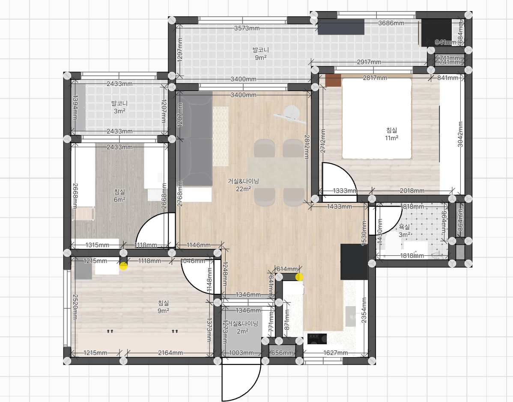

# 인테리어 결정 기록(통합본)

> 이 문서는 `공통.md` 및 `spaces/*.md`의 내용을 PDF 출력용으로 한 파일에 통합한 버전입니다.  
> 원본은 각 파일에서 계속 누적 관리합니다.

---

## 평면도
@../pic/sample.png

---

## 목차
- [공통(전역)](#공통전역)
- [현관](#현관)
- [거실](#거실)
- [주방](#주방)
- [화장실](#화장실)
- [안방](#안방)
- [서재](#서재)
- [옷방](#옷방)

---

## 공통(전역)

## 결정(확정)
- 전체 톤/컨셉 > 우드: 시트지/원목/무늬목 모두 톤을 맞춘다 (확정)

## 후보/메모(미확정 포함)
- 전체 톤/컨셉: 화이트 + 우드 (예정)
- 전체 톤/컨셉 > 방향: 과한 디테일보다는 미니멀한 방향 선호 (예정)
- 바닥 > 마감: 장판 (예정)
- 벽지 > 계획: 거실=실크벽지, 기타 공간=다른 벽지 고려 (예정)
- 타일 > 발코니/창호턱: 교체 여부 고민(기존 타일이 촌스러워 보임) (미정)
- 몰딩: 시공 (예정)
- 걸레받이: 시공 (예정)
- 목공 > 디테일: 라운딩 등 실용성 낮은 디테일은 최대한 배제 (예정)
- 조명 > 형태: 전체 다운라이트(매입등) 위주 (예정)
- 조명(대전제) > 메인조명 색온도: 4000K (후보)
- 조명(대전제) > 간접등 색온도: 3000K (후보)
- 창호 > 브랜드/등급: 1군 브랜드 중간등급 (예: LX 슈퍼세이브5) (예정)
- 창호 > 형태: 조립창 X, 완성창 선호 (예정)
- 창호 > 외창: 발코니 전용창 (예정)
- 창호 > 외창 > 유리두께: 기본 (약 28mm 추정) (예정)
- 창호 > 외창 > 유리: 로이유리 적용 (예정)
- 창호 > 옵션: 이지핸들 적용(전반) (예정)
- 창호 > 옵션: 방충망 적용(전반) (예정)

## 가전/설비/가구
- 냉난방 > 시스템 에어컨: 거실/안방/서재 3대 적용 희망 (예정)

## 질문/해야 할 일
- 통신 > 인터넷선/랜포트: 거실/서재/안방 위치 및 포트 수량 고려
- 전기 > 조명: 회로 분리(공간별/구역별) 구성 필요

---

## 현관

## 결정(확정)
- 중문: 설치 (확정)

## 후보/메모(미확정 포함)
- 중문 > 방식: 3연동 슬라이드 (예정)
- 중문 > 패널/유리 > 타입: 반투명 선호 (후보)
- 중문 > 방식: 가격에 따라 결정 (탈락: 3연동 슬라이드로 방향 구체화)
- 중문 > 방식 후보: 슬라이딩 계열 선호 (탈락: 3연동 슬라이드로 구체화)
- 수납(신발장) > 하부: 띄움 (후보)
- 수납(신발장) > 하부조명: 간접등 고려 (후보)
- 수납(신발장) > 소물공간: 차키/지갑 등 올려둘 공간을 신발장 제작 시 포함 (후보)
- 가구/제작 > 신발장: 키큰장(상부까지 꽉 채움) vs 낮게/여유 있게(답답함 최소화) 고민 (후보)
- 전기 > 스위치: 현관 일괄소등 스위치 적용 (후보)

## 가전/설비/가구
- (없음)

## 질문/해야 할 일
- 중문 예산 범위(대략): (미정)

---

## 거실

## 결정(확정)
- 구조/확장 > 베란다 확장: 안함 (확정)

## 후보/메모(미확정 포함)
- 창호(거실 베란다) > 외창: 단창 (예정)
- 창호(거실) > 분합창: 단창 (예정)
- 조명 > 간접등: 적용 여부 고민(커튼박스/천장 라인 등 위치, 디밍·회로분리 포함 검토) (후보)
- 벽지 > 종류: 실크벽지 (예정)
- 수납(거실 베란다) > 수납장: 시스템 에어컨 시 기존 하부 호스가 상단으로 올라가면 설치 가능성 검토 (후보)

## 가전/설비/가구
- 가구 > 식탁: 4인(약 1400x800) (예정)
- 가구 > 소파: 3인용(사이즈 미정) (예정)
- 가전 > 거실 TV: 미배치(스탠바이미로 대체) (예정)
- 가전 > 스탠바이미: 배치 예정 (예정)

## 질문/해야 할 일
- 전기 > 콘센트 위치: 스탠바이미/공유기 위치 기준으로 계획 필요
- 통신 > 랜선/랜포트: 공유기 설치 위치 기준으로 배선/포트 구성 계획 필요
- 전기 > 조명 위치: 거실 식탁(4인, 약 1400x800) 위치 기준으로 조명 위치(다운라이트/펜던트 등) 계획 필요

---

## 주방

## 결정(확정)
- (없음)

## 후보/메모(미확정 포함)
- 가구/제작 > 보조 조리대: ㄷ자형 보조 조리대(가벽형) (펜트리 철거 후 생성되는 상판 포함, 시계방향: 싱크볼 > 조리대 > 코너(조미료/밥솥 공간) > 인덕션) (예정)
- 가구/제작 > 상판 > 높이: 기존 대비 +2cm로 약 900mm(90cm)로 할지 고민 (후보)
- 가구/제작 > 수납(하부) > 코너장: ㄷ자 코너 공간 활용 위해 양쪽으로 여는 하부 수납(코너장) 구성 고려 (후보)
- 가구/제작 > 싱크대 하부장: 로봇청소기 스테이션(빌트인) 구성 (후보)
- 가구/제작 > 싱크대 하부장 > 로봇청소기: 자동 물교환 기능 모델 고려(수도/배수 필요) (후보)
- 가구/제작 > 싱크대/상판: 상판 길이 및 싱크대 배치안 고민 필요 (탈락: ㄷ자 상판 구성(시계방향)으로 구체화되어 통합)

## 가전/설비/가구
- 조명 > 간접등: 주방 윗 선반 하부 간접등 (예정)
- 가전/설비 > 쿡탑: 인덕션 (예정)
- 가전/설비 > 정수기: 설치 (펜트리 철거 후 생기는 상판에 배치) (예정)
- 가전 > 전자레인지: 상판형 (예정)
- 가전 > 밥솥: 추가 (예정)
- 가전 > 냉장고: 키친핏(912×1853×697), 싱크대 상판 옆 배치 (예정)

## 질문/해야 할 일
- 전기 > 인덕션: 전용 배선/전용 회로 필요(차단기·배선·용량) 확인
- 전기 > 콘센트: 전자레인지(상판형)/밥솥 위치 기준으로 수량·높이·배치 계획
- 설비 > 급/배수: 로봇청소기 자동 물교환용 급수/배수 연결 가능 여부 확인
- 설비 > 정수기 급수: 분배기(싱크볼 하부)에서 펜트리 철거 상판의 정수기 위치까지 급수 라인 연결/연장 방법 업체 문의 필요
- 목공/전기 > 스위치: 주방 냉장고 옆 목공장(키친핏) 측면에 화장실 스위치 매립/이설 가능 여부 및 시공 범위(배선 연장, 박스 규격, 마감) 확인
- 가구/동선 > 배치: 냉장고(912폭) + 싱크대 상판 옆 배치 시 동선/문열림 간섭 체크

---

## 화장실

## 결정(확정)
- (없음)

## 후보/메모(미확정 포함)
- 철거 > UBR: 전부 철거 (예정)
- 방수/설비 > 시공: 방수 및 설비 시공 재진행 (예정)
- 배수 > 시공: 이중배수 (예정)
- 하자/누수 > 오수관(윗집) 주변: 습기/물기 관찰 (미정)
- 하자/오염 > 변기 뒤/바닥 실리콘: 오수 흔적 관찰 (미정)
- 타일 > 규격: 300x600, 600x600 (후보)
- 천장 > 마감: SMC (예정)
- 시공 > 젠다이: 구배 포함 시공 (예정)
- 샤워부스 > 턱: 적용 여부 고민 (후보)
- 샤워부스 > 파티션: 유리 파티션 vs 조적 (후보)
- 환기/난방 > 환풍 시스템: 휴젠뜨(온풍 기능) vs 댐퍼 포함 환풍기 (후보)
- 조명 > 센서등: 적용 (예정)

## 가전/설비/가구
- 가구/제작 > 거울장: 설치 (예정)
- 조명 > 간접등: 거울장 하부 간접등 (예정)
- 도기 > 세면대: 하부 관 노출 모델 (예정)
- 도기 > 변기: 물탱크형 (예정)
- 샤워부스 > 샤워기: 해바라기 샤워(레인샤워) 포함 여부 고민 (후보)

## 질문/해야 할 일
- 환기 > 제품/방식: 휴젠뜨 설치 필요성(온풍/제습/소음/전기) 비교
- 환기 > 역풍/냄새: 댐퍼 필요 여부 및 타입(역류방지 성능) 확인
- 환기 > 성능: 환풍기 개수 증가 시 체감 개선 여부(배치/용량/덕트 영향) 확인
- 환기 > 시공 조건: 천장 공간/배관·덕트/전기 용량/점검구 필요 여부 확인
- 전기 > 콘센트 위치: 장 내부 vs 세면대 옆 위치 비교/결정
- 설비 > 청소용 호스: 설치 위치(세면대/변기 근처 등) 및 급수/배수 조건 고려
- 설비/시공 > 변기 접합부: 철거 후 방수·실리콘 재시공 + 누수/역류 원인 확인 필수

---

## 안방

## 결정(확정)
- (없음)

## 후보/메모(미확정 포함)
- 냉난방 > 시스템 에어컨: 공통.md 참조 (예정)
- 천장 > 단내림: 시스템 에어컨(실내기/배관) 고려하여 단내림 적용 (예정)
- 창호(안방 베란다) > 외창: 단창 (예정)
- 창호(안방) > 하프창: 이중창 (예정)
- 조명 > 간접등: 적용 여부 고민(헤드보드/커튼박스 등 위치, 3000K·디밍·회로분리 포함 검토) (후보)
- 가전/설비(안방 베란다) > 세탁: 워시타워 vs 드럼세탁기 (후보)
- 가전/설비(안방 베란다) > 건조대: 천장 기존 빨래건조대 유지/철거 고민 (후보)

## 가전/설비/가구
- 가구 > 침대: 킹사이즈 (예정)
- 가구/제작 > 붙박이장: 3칸 구성(좌/우=이불 등 보관, 중앙=옷 보관) (기존도 3칸, 문짝 교체/신규 제작 모두 3칸 유지) (예정)
- 가전/설비(안방 베란다) > 세탁기: 설치 (예정)
- 가전/설비(안방 베란다) > 분리수거: 배치 (예정)
- 가전/설비(안방 베란다) > 음식물 처리기: 전기식 배치 (예정)
- 가구/제작(안방 베란다) > 수납: 세탁용품(세제 등) 소형 수납공간 필요 (예정)

## 질문/해야 할 일
- 가구 > 침대 프레임: 핸드폰 충전(콘센트/USB)·조명·선반/수납 옵션 및 전선정리 방식 체크
- 가구/제작 > 붙박이장: 문짝만 교체 vs 철거 후 신규 제작 견적 비교 후 결정 (미정)
- 치수/용량(안방 베란다) > 세탁: 공간 협소 → 제품 사이즈 기준으로 용량/구성 결정
- 치수/간섭(안방 베란다) > 세탁기: 창호턱 돌출로 설치 간섭 가능성 → 워시타워(폭 약 700mm) 기준으로 실측(유효 폭/깊이/문폭) 후 가능 여부 확인
- 설비 > 급수: 수도꼭지 위치 변경 또는 납작형(로우프로파일) 교체 필요 여부 확인
- 전기 > 배선/콘센트: 세탁(워시타워/드럼) + 음식물 처리기 + 분리수거 구역 전원 계획

---

## 서재

## 결정(확정)
- (없음)

## 후보/메모(미확정 포함)
- 공간사용 > 서재 베란다: 창고 용도 (예정)
- 수납 > 서재 베란다: 수납 구성 고민 필요(예: 철제 렉) (후보)
- 창호(서재 베란다) > 외창: 단창 (예정)
- 창호(서재) > 분합창: 단창 (예정)
- 냉난방 > 시스템 에어컨: 공통.md 참조 (예정)
- 천장 > 단내림: 서재 공간 협소 → 시스템 에어컨 단내림 적절성 판단 필요 (후보)

## 가전/설비/가구
- 가구 > 데스크: 1800 폭 1개 (예정)
- 가구 > 데스크: 1300 폭 1개 (예정)
- 가구 > 책장: 1300 폭 1개 (예정)

## 질문/해야 할 일
- 천장/냉난방 > 단내림: 서재 시스템 에어컨 단내림 시 답답함/간섭 여부(조명/커튼박스 포함) 확인

---

## 옷방

## 결정(확정)
- (없음)

## 후보/메모(미확정 포함)
- 구조/확장 > 베란다 확장: 베란다 없애고 확장 고려 (후보)
- 창호(옷방 확장) > 외창: 이중창 (예정)
- 가구/제작 > 수납: 시스템 행거 vs 붙박이장 (후보)

## 가전/설비/가구
- 가전 > 스타일러: 1대 배치 (예정)

## 질문/해야 할 일
- 확장 > 가능 여부: 베란다 곰팡이 자국 있는 상태에서 확장 가능/권장 여부 확인(원인 진단 포함)
- 단열/창호 > 시공 디테일: 미장 치기 전, 샤시 턱 및 측부 외벽 접점부 기밀 시공 포함 여부 체크
- 단열/설비 > 우수관: 확장 시 우수관 배관 단열 포함 여부 및 단열 방식 확인
- 전기 > 화장대: 확장 시 화장대 공간 구성(헤어드라이어 등) 고려 → 콘센트 위치/개수 계획 필요

